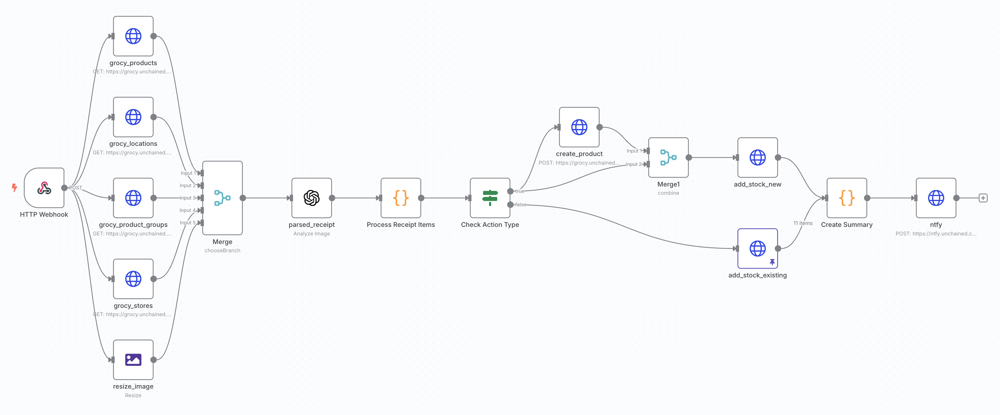
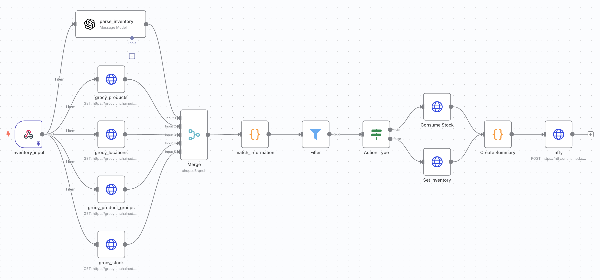
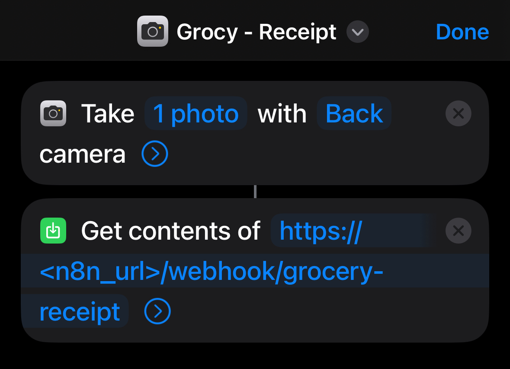
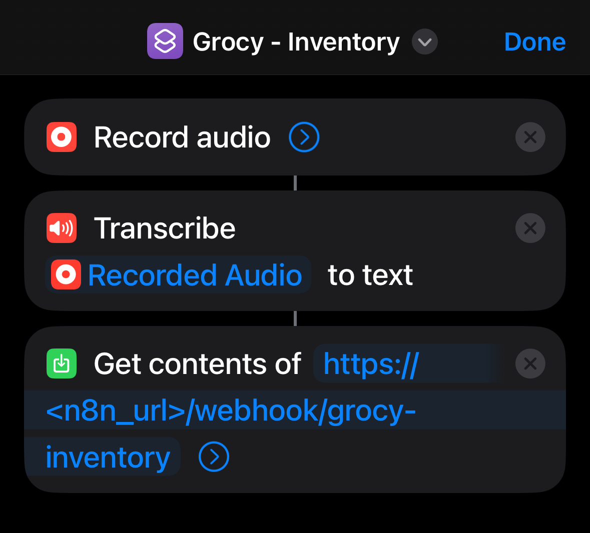
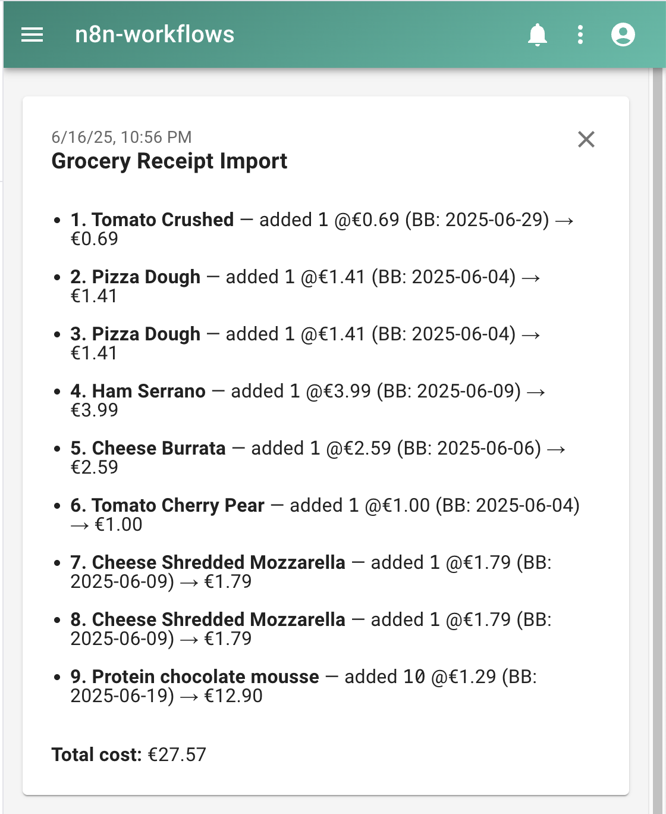

# Grocy Automation Workflows

n8n workflows for automating grocery inventory management with Grocy.

## Workflows

### 1. Grocy Receipt Processor

[`workflows/grocy_receipt.json`](workflows/grocy_receipt.json)

Automatically processes grocery receipt images using a vLLM to extract items and add them to Grocy.

**Features:**

- OCR receipt processing (using `gpt-4`)
- Automatic product matching (with support for product groups, locations, stores, unit prices)
- Creates new products if needed
- Bulk inventory updates
- Real-time notifications (`ntfy`)

### 2. Grocy Inventory Manager

[`workflows/grocy-inventory-manager.json`](workflows/grocy-inventory-manager.json)

Natural language inventory management for consuming, adding, or setting stock levels.

**Features:**

- Natural language input processing
- Smart product matching
- Automatic stock adjustments
- Real-time notifications (`ntfy`)

## Apple Shortcuts

For both workflows, you can use the provided Apple Shortcuts to easily trigger them from your iOS device.

### 1. Grocy Receipt Processor Shortcut

Import with [iCloud share link](https://www.icloud.com/shortcuts/b31f2aeec72e48f58c5cf2b5b87798be).

[`shortcuts/grocy_receipt_processor.shortcut`](shortcuts/grocy_receipt_processor.shortcut)

Opens the camera to take a photo of a grocery receipt and sends the image to the n8n workflow webhook URL.

### 2. Grocy Inventory Manager Shortcut

Import with [iCloud share link](https://www.icloud.com/shortcuts/e6fc89b871024aa0936530f0c73caec8).

[`shortcuts/grocy_inventory.json`](shortcuts/grocy_inventory.json)

Opens a voice recorder to capture a running inventory update and sends the audio to the n8n workflow webhook URL.

## Setup

Update these placeholders in the workflows:

- `<grocy_url>` → Grocy instance URL
- `<n8n_url>` → n8n instance URL
- `<ntfy_url>` → ntfy instance URL (if using notifications)
- Remember to set all credentials referenced in the workflows (e.g., OpenAI, Grocy API)

## Notifications

Notifications are sent using `ntfy` ([ntfy.sh](https://ntfy.sh)) to keep you updated on the status of your workflows.

Markdown processing by `ntfy` is only available in the web interface, and won't render in the mobile apps. You can always tweak the summary node in the workflows to customize the notification content.

## Useful Links

- [Grocy REST API Documentation](https://en.demo.grocy.info/api#/openapi.json)
